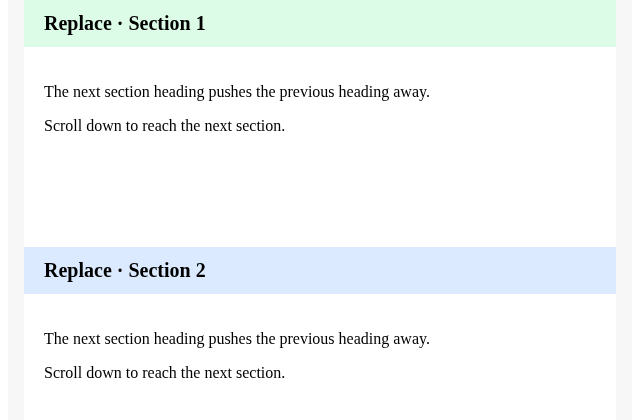
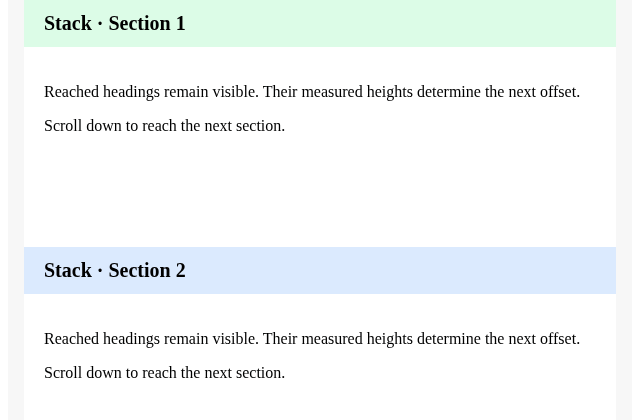

# React Sticky Kit

<p align="left">
  <a href="https://www.npmjs.com/package/react-sticky-kit" target="_blank">
    
  </a>
  <a href="https://img.shields.io/npm/dm/react-sticky-kit?style=flat-square" target="_blank">
    
  </a>
  <a href="https://github.com/oe/react-sticky-kit" target="_blank">
    
  </a>
  <a href="https://github.com/oe/react-sticky-kit/actions" target="_blank">
    
  </a>
  <a href="https://github.com/oe/react-sticky-kit/blob/main/LICENSE" target="_blank">
    
  </a>
  <a href="https://www.typescriptlang.org/" target="_blank">
    
  </a>
  <a href="#ssr-ssg-support" target="_blank">
    
  </a>
</p>

Coordinate multiple sticky section headers in React. Stack headers using their actual
heights, replace a section header as the next one arrives, or mix both behaviors
under a shared viewport offset.

## Why React Sticky Kit?

- **Sticky behavior without requiring CSS sticky support.** The default
  `positionStrategy="fixed"` coordinates viewport positioning with JavaScript and
  `position: fixed`. It works without native `position: sticky` when the browser
  meets the React and JavaScript requirements below.
- **Automatic coordination of variable-height headers.** Stack, replace or mix
  headings without maintaining per-header heights and offsets in your app.
- **Keep oversized content reachable.** Opt into group scrolling with
  `overflowBehavior="scroll"`; active stack items move together without overlapping.
- **Choose native positioning when it fits.** Opt-in `positionStrategy="auto"`
  uses CSS sticky for eligible short, single items and falls back to fixed when
  support or layout conditions are missing. Native items without a height callback
  skip scroll-driven library updates.
- **Shared work across groups.** Scroll/resize listeners, frame scheduling and
  observers are shared; geometry reads finish before styles are written.

Native CSS remains a good choice for a simple layout when your target browsers
support it. Choose this kit for coordinated dynamic headings, mixed modes,
measured total sticky height, or a fixed implementation independent of CSS sticky.
This is not a claim of universal browser compatibility or the smallest bundle.

[Browser support and fallback behavior](#browser-support-and-fallbacks) ·
[Detailed compatibility guide](docs/browser-compatibility.md)

## See the behavior

| Replace section headings | Stack reached headings |
| --- | --- |
|  |  |

- **Replace:** an alphabetical contact list updates its section heading as you scroll.
- **Stack:** previously reached headings accumulate below the shared offset; their
  heights are measured automatically, including when content changes.
- **Mixed:** keep a page title stacked while section headings replace below it.

[Open the live demo](https://app.evecalm.com/react-sticky-kit/) — no installation required.
Try [replace](https://app.evecalm.com/react-sticky-kit/#replace),
[stack](https://app.evecalm.com/react-sticky-kit/#stack), or
[mixed modes](https://app.evecalm.com/react-sticky-kit/#mixed-mode).
The demo also includes dynamic heights, nested groups and container boundaries.
To edit an example, use the [contact-list sandbox](https://codesandbox.io/p/sandbox/dreamy-hofstadter-v9dzfz);
see [running the demo](#run-the-demo) for local development.

## Content taller than the viewport

Keep the existing Container / Item structure and opt into coordinated scrolling:

```tsx
<StickyContainer defaultMode="stack" overflowBehavior="scroll"
  offsetTop={16} offsetBottom={16} positionStrategy="auto">
  <StickyItem><Sidebar /></StickyItem>
  <main>{content}</main>
</StickyContainer>
```

Oversized active items scroll as one group before pinning their top or bottom
edge. The default behavior remains unchanged. `auto` uses native sticky for
eligible single short items and falls back to fixed positioning for other cases.
This is still a viewport-scrolling API, not support for internal scroll frames.
See [behavior, compatibility checks and measurements](docs/oversized-content.md).

## Installation

```bash
npm install react-sticky-kit
# or: pnpm add react-sticky-kit
```

## Quick start: replacing section headers

Import the stylesheet once. Give sections enough content to scroll; headers replace
one another within the container's boundary.

```tsx
import { StickyContainer, StickyItem } from 'react-sticky-kit';
import 'react-sticky-kit/style';

export default function Sections() {
  return (
    <StickyContainer defaultMode="replace" offsetTop={48}>
      <StickyItem><h2 style={{ margin: 0, padding: 12, background: '#fff' }}>Overview</h2></StickyItem>
      <section style={{ minHeight: 600 }}>Overview content</section>
      <StickyItem><h2 style={{ margin: 0, padding: 12, background: '#fff' }}>Details</h2></StickyItem>
      <section style={{ minHeight: 600 }}>Details content</section>
    </StickyContainer>
  );
}
```

Change `defaultMode` to `"stack"` to retain previously reached headings. To keep a
page title above replacing section headings, add a first `<StickyItem mode="stack">`.
Offsets are relative to the **viewport**, including when scrolling an inner element.
For offsets relative to a scrollable panel, prefer native CSS sticky positioning.

## Which approach should I choose?

| Need | Start with |
| --- | --- |
| A single sticky navigation bar or simple grouped list | Native CSS `position: sticky`, when supported by your target browsers |
| Viewport-based tall content or oversized coordinated groups | React Sticky Kit, `overflowBehavior="scroll"` |
| Sticky behavior without native CSS sticky support | React Sticky Kit, default fixed strategy (runtime requirements still apply) |
| Internal scroll-container coordinates or short-sidebar bottom alignment | A sidebar-focused solution such as `react-sticky-box` |
| Dynamic-height headers that stack automatically | React Sticky Kit, `stack` mode |
| A persistent title above replacing section headings | React Sticky Kit, mixed modes |
| The current total sticky height | `onStickyItemsHeightChange` |
| Table columns, built-in virtualization, or hide-on-scroll navigation | A solution designed for that specific interaction |

React Sticky Kit defaults to fixed positioning; opt-in auto uses native sticky
for eligible layouts. It is not a drop-in
replacement for scroll-container-relative sticky behavior. Ancestor transforms
and overflow clipping can affect fixed positioning.

React 17/18/19, SSR and TypeScript 5 NodeNext consumers are covered by package
checks. The ESM artifact is approximately **4.56 kB gzip**, excluding React and CSS;
there are no additional runtime dependencies. See the
[performance audit](docs/performance.md) for methods and tradeoffs.

For practical examples and existing-library migration, see the
[patterns and migration guide](docs/patterns-and-migration.md).

## Props

### `<StickyContainer />`
| Prop                        | Type                                                 | Default     | Description                                                                                 |
|-----------------------------|------------------------------------------------------|-------------|---------------------------------------------------------------------------------------------|
| `offsetTop`                 | `number`                                             | `0`         | Offset from the top of the viewport                                                         |
| `offsetBottom` | `number` | `0` | Bottom space reserved for oversized scrolling groups |
| `overflowBehavior` | `'pin' \| 'scroll'` | `'pin'` | Opt into coordinated scrolling of oversized active items |
| `positionStrategy` | `'fixed' \| 'auto'` | `'fixed'` | Opt into native sticky for eligible single short items |
| `defaultMode`               | `'replace' \| 'stack' \| 'none'`                     | `'replace'` | Default sticky mode for all items                                                           |
| `baseZIndex`                | `number`                                             | `200`       | Base z-index for sticky items. Should be greater than the number of sticky items.            |
|                             |                                                      |             | In `replace` mode, z-index = baseZIndex - index; in `stack` mode, z-index = baseZIndex + index. |
| `onStickyItemsHeightChange` | `(height: number) => void`                          |             | Callback when total sticky height changes                                                   |
| `constraint`                | `'none'`                                             |             | Define the constraint for sticky behavior. 'none' = no container boundary |

### `<StickyItem />`
| Prop    | Type                                 | Default | Description                                 |
|---------|--------------------------------------|---------|---------------------------------------------|
| `mode`  | `'replace' \| 'stack' \| 'none'`     |         | Sticky mode for this item (overrides StickyContainer) |

## Sticky Modes
- **replace**: Only one sticky item is visible at a time, replacing the previous.
- **stack**: Sticky items stack on top of each other.
- **none**: Sticky is disabled for this item.

## Constraint Behavior

The `constraint` prop allows you to control when sticky items should stop being sticky:

```tsx
import React from 'react';
import { StickyContainer, StickyItem } from 'react-sticky-kit';

function Example() {
  return (
    <div>
      {/* 1. Default: Container-based constraint */}
      <StickyContainer>
        <StickyItem><div>Sticky stops when container leaves viewport</div></StickyItem>
        <div>Content...</div>
      </StickyContainer>
      
      {/* 2. No container boundary */}
      <StickyContainer constraint="none">
        <StickyItem><div>Sticky even after the container leaves</div></StickyItem>
        <div>Content...</div>
      </StickyContainer>
    </div>
  );
}
```

### Special behavior of `constraint="none"`

When you set `constraint="none"`, the sticky items will always stick when they reach the top of the viewport, regardless of their parent container's visibility. Offsets remain relative to the viewport; this differs from native CSS `position: sticky`, which is constrained by its scrolling ancestor.

In contrast, the default behavior (without specifying a constraint) only makes items sticky when their parent container is visible in the viewport.

## Run the demo

The demo builds as a standalone static site with `pnpm build:demo`. Its relative
asset paths work when hosted under a repository subdirectory.
See [deployment instructions](docs/demo-deployment.md) for GitHub Pages setup.

Run the demo locally:

```bash
pnpm install
pnpm dev
```

Open [http://localhost:5173](http://localhost:5173) and switch between demo pages to explore all features and edge cases:
* [iOS Contact](http://localhost:5173/#ios-contact) a dead simple iOS contact clone
* [Mixed mode](http://localhost:5173/#mixed-mode) mix replace/stack/none mode
* [Nested](http://localhost:5173/#nested) nest sticky containers
* [Dynamic sticky items](http://localhost:5173/#dynamic) dynamic sticky items(add/remove)
* [Dynamic offsetTop](http://localhost:5173/#dynamic-offset) dynamic offsetTop that adapts to header height changes
* [Constraint Demo](http://localhost:5173/#constraint) demo showing different constraint options

## Native positioning and bundle size

Use the existing entry and set `positionStrategy="auto"` to opt into native
sticky for eligible layouts. All modes, offsets, boundaries, long-content
scrolling and callbacks remain available through synchronous fixed fallback.
Switching strategies retains child state.

Native positioning reduces JavaScript work during scrolling; it does not remove
fixed code from the download. The single entry includes both implementations,
so fallback has no additional chunk request or cold-loading delay. Bundlers cannot
infer browser CSS support or eliminate the backend from a runtime JSX prop.

## Browser support and fallbacks

**Native `position: sticky` is not required by the default fixed strategy.**
The `auto` strategy is optional; it checks sticky support, ResizeObserver and
layout eligibility before choosing native positioning.

| Browser / layout capability | Default `fixed` | Opt-in `auto` |
| --- | --- | --- |
| Native sticky supported, eligible short single item | Fixed coordination | Native sticky |
| Native sticky unavailable or cannot be detected | Fixed coordination | Falls back to fixed |
| ResizeObserver unavailable | Fixed; refreshes on scroll, window resize and React commits | Falls back to fixed with the same refresh behavior |
| Tall, multiple or otherwise ineligible items | Fixed coordination | Falls back to fixed |

React 17+ is required, and distributed JavaScript targets ES2018. Browsers must
also provide the standard DOM APIs used by React and the library, including
requestAnimationFrame, Map and Set. CSS sticky independence is not an IE11 or
all-legacy-browser support promise. Older environments need application-level
transpilation/polyfills and their own validation; they are not certified targets.

Regression tests run in Chromium, Firefox and WebKit, including simulated absence
of native sticky support and ResizeObserver. They are engine-based tests, not a
certified minimum-version list for every browser or embedded WebView.
See [compatibility details and layout limits](docs/browser-compatibility.md).

## SSR/SSG Support

React Sticky Kit supports Server-Side Rendering (SSR) and Static Site Generation (SSG), working seamlessly with frameworks like Next.js, Gatsby, Astro, and more.

### Next.js Example

```tsx
// app/page.tsx (Next.js App Router)
import { StickyContainer, StickyItem } from 'react-sticky-kit'
import 'react-sticky-kit/dist/style.css'

export default function Home() {
  return (
    <StickyContainer>
      <StickyItem>
        <header>Sticky Header</header>
      </StickyItem>
      <main>Content...</main>
    </StickyContainer>
  )
}
```

For Pages Router, import the global stylesheet from `pages/_app.tsx`.

### Astro Example

Create a React component containing both `StickyContainer` and `StickyItem`, then
hydrate it from Astro:

```astro
---
import StickyLayout from '../components/StickyLayout.tsx'
import 'react-sticky-kit/style'
---
<StickyLayout client:load />
```

## Compatibility and updates

React 17 and later are supported. Import the stylesheet explicitly, using either
`react-sticky-kit/style` or `react-sticky-kit/dist/style.css`. ESM, CommonJS and the
UMD browser build are available; UMD requires a global `React`.

The built entry points include `"use client"` for Next.js App Router. Pages Router
and server rendering remain supported; sticky layout is applied after mounting.
For Astro, wrap the sticky layout in a React component and hydrate that component
as a single island.

Sticky offsets use the viewport, even when an event comes from a nested scrolling
element. Ancestor transforms and overflow clipping can affect fixed positioning;
use native CSS `position: sticky` if you need offsets relative to a scrolling ancestor.

When available, `ResizeObserver` updates dynamic content heights and widths, and
tracks ancestor and preceding sibling sizes that can move the container. Shared,
scoped `MutationObserver` subscriptions refresh these observations when the surrounding
DOM structure or relevant classes/styles change. Observers and global scroll/resize
listeners are shared across containers. No continuous polling is used.
Without `ResizeObserver`, measurements update on scroll, window resize and component
commits. Native browser scroll anchoring can move the viewport when content above
it changes; sticky positions follow the resulting viewport.

Wrapper padding, borders and `box-sizing` are accounted for when preserving the
placeholder and content width. Definite inline heights are retained. Fixed headers
also follow horizontal scrolling. Per-item layout metrics are cached and invalidated
by observed dimension changes, window resize, relevant DOM changes and React
commits. Inactive or fully replaced headers do not have their content heights measured during scrolling.
`onStickyItemsHeightChange` reports the final total once per animation frame, after
all scheduled containers have applied their styles, when it changes, including zero when no items remain sticky. It does not emit transient
per-item totals or callbacks after the container unmounts.

## Performance

Scheduled containers share one animation frame. Their geometry reads finish before
any sticky styles are written, and unchanged layouts skip repeated style handling.
Inactive content heights are not measured.
Prefer grouping related sections in one container rather than mounting a container
for every row. Large numbers of simultaneously stacked headers still require
per-frame geometry reads. See the [performance audit](docs/performance.md) for
stress-test findings and limitations.

## Development

Use Node.js 22.22.2+ or 24.15.0+ and the pnpm version pinned in `package.json`.
The development tools require these versions; the published library keeps its
React 17+ peer dependency range and targets ES2018.

```bash
pnpm install --frozen-lockfile
pnpm type-check
pnpm lint
pnpm test
pnpm build
pnpm check:package
pnpm check:compatibility # installs the tarball with React 17, 18 and 19
pnpm exec playwright install --with-deps chromium firefox webkit
pnpm test:browser
```

TypeScript 6 is used for development while the ESLint TypeScript plugin supports
versions below 6.1. Generated declarations use the existing public component API.

## Publish steps

`pnpm pub`

## License

MIT
